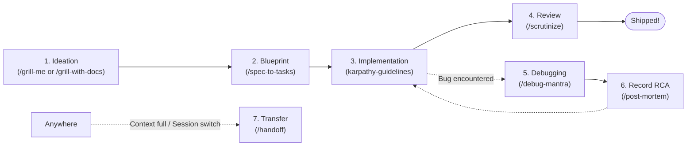

# Rachapol Skills — Agent Guide (`CLAUDE.md`)

Instructions for AI coding agents operating in and consuming this repository.

## Repository Overview

`Rachapol-skills` is a curated collection of production-grade **Agent Skills** compliant with the open [skills.sh](https://skills.sh) ecosystem (by Vercel Labs). The suite is engineered to provide disciplined, high-signal workflows for AI coding agents (Claude Code, Antigravity, Cursor, Codex, OpenCode, etc.), eliminating hallucinated scope, preventing accidental regressions, and providing structured problem-solving loops.

Skills are organized into two promoted bucket directories under `skills/`:

- `skills/engineering/`: Daily software engineering, debugging, code review, and specification decomposition.
- `skills/productivity/`: Socratic ideation, domain modeling, requirement clarification, and cross-session handoffs.

---

## The 8 Core Skills

### 1. Engineering Skills (`skills/engineering/`)

| Skill | Invocation | Purpose |
| :--- | :--- | :--- |
| [`spec-to-tasks`](./skills/engineering/spec-to-tasks/SKILL.md) | **User-invoked** (`/spec-to-tasks`) | Synthesizes conversation and planning into a Technical Specification (with In-Scope vs Out-of-Scope boundaries) and breaks it down into sequential Tracer-Bullet Tasks with explicit dependencies. |
| [`karpathy-guidelines`](./skills/engineering/karpathy-guidelines/SKILL.md) | **Model-invoked** (Always active) | The execution constitution: Think before coding, Simplicity first (minimal code), Surgical changes (touch only what you must), and Goal-driven execution (verifiable goals). |
| [`scrutinize`](./skills/engineering/scrutinize/SKILL.md) | **User / Model** (`/scrutinize`) | Outsider-perspective code & plan review. Questions intent, traces actual call paths end-to-end (not just the diff), and verifies claims against edge cases. |
| [`debug-mantra`](./skills/engineering/debug-mantra/SKILL.md) | **User / Model** (`/debug-mantra`) | Four-step debugging discipline: 1. Reproduce reliably, 2. Know fail path (debugger -> trace -> instrumentation), 3. Falsify hypothesis, 4. Maintain a breadcrumb ledger. |
| [`post-mortem`](./skills/engineering/post-mortem/SKILL.md) | **User-invoked** (`/post-mortem`) | Generates the canonical engineering record (RCA) of a resolved bug in `docs/post-mortems/<date>-<slug>.md`. Ingests repro and breadcrumb ledger from `debug-mantra`. |

### 2. Productivity Skills (`skills/productivity/`)

| Skill | Invocation | Purpose |
| :--- | :--- | :--- |
| [`grill-me`](./skills/productivity/grill-me/SKILL.md) | **User-invoked** (`/grill-me`) | Relentless Socratic interview to stress-test ideas and architecture in-chat without creating workspace files (stateless brainstorming). |
| [`grill-with-docs`](./skills/productivity/grill-with-docs/SKILL.md) | **User-invoked** (`/grill-with-docs`) | Rigorous Socratic interview for real codebases. Actively establishes ubiquitous language in `CONTEXT.md` and records architectural decisions in `docs/adr/`. |
| [`handoff`](./skills/productivity/handoff/SKILL.md) | **User-invoked** (`/handoff`) | Compacts current conversation state into a structured handoff document saved to the OS temp directory. Scrubs secrets and provides suggested skills for the receiving agent. |

---

## End-to-End Workflow Pipeline

Agents working with this repository or running these skills should respect the unified pipeline:



1. **Ideation & Clarification:** When starting a new feature or architectural change, use `/grill-with-docs` (in a repository) or `/grill-me` (general ideation). Settle all questions on the frontier.
2. **Decomposition:** Once requirements crystallize, run `/spec-to-tasks`. Do not jump straight to coding. Generate the spec and vertical tracer-bullet checklist.
3. **Execution:** Execute tasks sequentially under `karpathy-guidelines`. Write minimal code, avoid speculative abstractions, and keep edits strictly surgical.
4. **Review:** Run `/scrutinize` to audit the diff and trace real execution paths cold before declaring completion.
5. **Incidents & Regressions:** If unexpected failures occur, pause coding and enter `/debug-mantra`. Once verified, capture the fix in `/post-mortem`.
6. **Session Boundaries:** If token limits approach or when handing off to a different agent, invoke `/handoff`.

---

## Installation Commands

Users can install skills from this repository into any supported coding agent using:

```bash
# Interactive selection
npx skills add Rachapol03/Rachapol-skills

# Install all skills without prompt
npx skills add Rachapol03/Rachapol-skills --all

# Install globally
npx skills add Rachapol03/Rachapol-skills -g

# Install specific skill
npx skills add Rachapol03/Rachapol-skills --skill spec-to-tasks
```

---

## Skill Authoring Conventions

When contributing or adding new skills to this repository:

1. **Bucket Placement:** Place skills in either `skills/engineering/<name>/` or `skills/productivity/<name>/`.
2. **Frontmatter:** Every skill must have `SKILL.md` starting with YAML frontmatter:
   ```yaml
   ---
   name: <kebab-case-name>
   description: <Action-oriented description. Front-load leading keywords for model discovery.>
   disable-model-invocation: true # Include only if user-invoked
   ---
   ```
3. **Invocation Strategy:**
   - Use `disable-model-invocation: true` for structural, macro-level workflow commands that must be explicitly triggered by the human (e.g. `/spec-to-tasks`, `/handoff`).
   - Omit `disable-model-invocation` for skills that the agent should proactively reach for during coding, debugging, or reviewing (e.g. `karpathy-guidelines`, `debug-mantra`, `scrutinize`).
4. **Self-Contained:** Every skill must be fully actionable on its own without 1-line forwarding wrappers.
5. **No Em-Dashes:** Do not use em-dashes in prose. Use colons, commas, periods, or parentheses instead.
