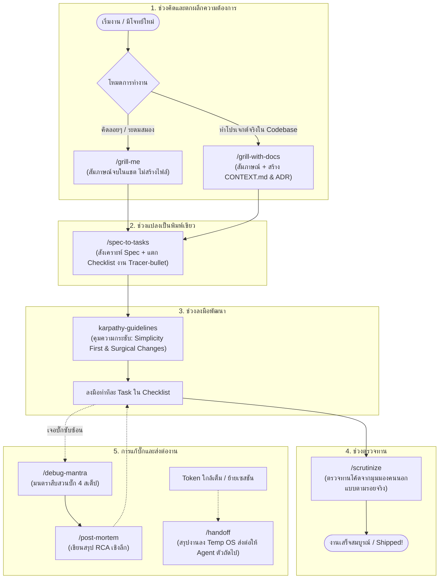

# Rachapol Skills

คลังรวมคำสั่งและทักษะพิเศษ (**Agent Skills**) สำหรับ **AI Coding Agents** (เช่น Claude Code, Antigravity, Cursor, Codex, GitHub Copilot, Windsurf) ตามมาตรฐาน [skills.sh](https://skills.sh) (Open Agent Skills Ecosystem)

ออกแบบมาเพื่อการพัฒนาซอฟต์แวร์จริง เน้นการทำงานที่กระชับ ป้องกันไม่ให้ AI ทำงานหลุดกรอบ หรือคิดโค้ดไปเอง โดยผสานแนวคิดหลักจาก **Matt Pocock** (Socratic Grilling, Domain Modeling, Tracer-Bullet Slices) และ **Andrej Karpathy** (Think Before Coding, Simplicity First, Surgical Changes, Goal-Driven Execution)

[](https://skills.sh/Rachapol03/Rachapol-skills)

---

## วิธีการติดตั้ง (Quick Start)

คุณสามารถติดตั้งชุดสกิลนี้ลงในโปรเจกต์ใดๆ ได้ทันทีผ่านคำสั่ง `npx skills`:

### 1. ติดตั้งแบบเลือกสกิลได้เอง (Interactive)
รันคำสั่งนี้ในโฟลเดอร์โปรเจกต์ของคุณ จะมีเมนูขึ้นมาให้เลือกสกิลที่ต้องการ:
```bash
npx skills add Rachapol03/Rachapol-skills
```

### 2. ติดตั้งทุกสกิลทันที (All-in-One)
ติดตั้งสกิลทั้งหมดครบทั้ง 8 ตัวโดยไม่ต้องกดเลือกทีละข้อ:
```bash
npx skills add Rachapol03/Rachapol-skills --all
```

### 3. ติดตั้งแบบ Global (ใช้งานได้กับทุกโฟลเดอร์บนเครื่อง)
ใส่ flag `-g` เพื่อติดตั้งเข้าสู่ระดับ User Profile ของเครื่อง:
```bash
npx skills add Rachapol03/Rachapol-skills -g
```

### 4. ติดตั้งเฉพาะบางสกิลที่ต้องการ
```bash
# ติดตั้งเฉพาะสกิลแตกงาน spec-to-tasks
npx skills add Rachapol03/Rachapol-skills --skill spec-to-tasks

# ติดตั้งสกิลสัมภาษณ์ grill-with-docs
npx skills add Rachapol03/Rachapol-skills --skill grill-with-docs
```

### 5. ตรวจสอบรายชื่อสกิลทั้งหมดในคลัง
```bash
npx skills add Rachapol03/Rachapol-skills --list
```

---

## แผนผังวงจรการทำงาน (End-to-End Workflow)

สกิลทั้ง 8 ตัวถูกออกแบบมาให้ทำงานประสานกันเป็นสายธารตั้งแต่เริ่มมีไอเดียจนถึงปิดงาน:



---

## แคตตาล็อก 8 สกิลหลัก (Core Skills Catalog)

### 1. หมวดวิศวกรรมซอฟต์แวร์ (`skills/engineering/`)

#### สกิลที่ผู้ใช้พิมพ์เรียกเอง (User-invoked)
* **[`spec-to-tasks`](./skills/engineering/spec-to-tasks/SKILL.md)** — สะพานเชื่อมระหว่างการวางแผนกับการเขียนโค้ด ทำหน้าที่สังเคราะห์บทสนทนาเป็น **Technical Specification** (ระบุขอบเขต In-Scope vs Out-of-Scope ชัดเจน) และแตกเป็น **Tracer-Bullet Tasks Checklist** พร้อมระบุลำดับก่อน-หลัง (Dependencies) เพื่อส่งต่อให้ `karpathy-guidelines` ทำงานทีละข้อ
* **[`post-mortem`](./skills/engineering/post-mortem/SKILL.md)** — บันทึกสรุปการแก้บั๊กอย่างเป็นทางการเชิงลึกสำหรับ Engineer (บันทึกสาเหตุในระดับโค้ด Root Cause, กลไกการเกิดบั๊ก, การทดสอบยืนยัน, และวิธีป้องกันในอนาคต) บันทึกลงใน `docs/post-mortems/<date>-<slug>.md` ให้อัตโนมัติ

#### สกิลที่ AI ทำงานร่วมอัตโนมัติ (Model-invoked & Hybrid)
* **[`karpathy-guidelines`](./skills/engineering/karpathy-guidelines/SKILL.md)** — กฎเหล็กคุมพฤติกรรม AI ในการเขียนโค้ด: Think before coding (ห้ามเดาสุ่ม), Simplicity first (เขียนโค้ดให้น้อยที่สุด), Surgical changes (แตะเฉพาะจุดที่สั่ง), และ Goal-driven execution (ตั้งเกณฑ์วัดผลและเทสต์ให้ชัดเจน)
* **[`scrutinize`](./skills/engineering/scrutinize/SKILL.md)** — ตรวจทาน Plan / PR / โค้ดที่เปลี่ยนแปลงจากมุมมองคนนอก โดยตั้งคำถามถึงเจตนาและไล่ตามรอยเส้นทางโค้ดจริง (Trace actual code paths) จากต้นน้ำถึงปลายน้ำ ไม่ดูเฉพาะแค่ diff
* **[`debug-mantra`](./skills/engineering/debug-mantra/SKILL.md)** — วินัยการสืบสวนบั๊ก 4 สเต็ป: 1. Reproduce reliably (ทำตัวทดสอบให้พังแน่นอนก่อน), 2. Know fail path (debugger -> source trace -> instrumentation), 3. Falsify hypothesis (หาทางหักล้างสมมติฐานก่อน), 4. Every run is a breadcrumb (บันทึกร่องรอยการทดลอง)

---

### 2. หมวดผลิตภาพและเวิร์กโฟลว์ (`skills/productivity/`)

#### สกิลที่ผู้ใช้พิมพ์เรียกเอง (User-invoked)
* **[`grill-me`](./skills/productivity/grill-me/SKILL.md)** — การสัมภาษณ์เค้นความคิดแบบโสเครตีส (Socratic Grilling) แบบไร้สถานะ (Stateless) สำหรับการคิดเร็ว ระดมสมอง และขจัดความคลุมเครือ จบในแชตโดยไม่สร้างไฟล์ในเครื่อง
* **[`grill-with-docs`](./skills/productivity/grill-with-docs/SKILL.md)** — การสัมภาษณ์เค้น Requirement เชิงลึกสำหรับโปรเจกต์จริง พร้อมบันทึกข้อตกลงและคำศัพท์เฉพาะลง `CONTEXT.md` และบันทึกการตัดสินใจสถาปัตยกรรมลง `docs/adr/` ทันที
* **[`handoff`](./skills/productivity/handoff/SKILL.md)** — สรุปงานและสถานะที่ค้างอยู่ลงโฟลเดอร์ชั่วคราว (`OS Temp Directory`) เมื่อแชตยาวหรือ Token ใกล้เต็ม พร้อมตัดข้อมูลความลับ (Secrets/Keys) ทิ้งอัตโนมัติ และระบุ Suggested Skills ให้ Agent ตัวถัดไปเปิดต่อได้ทันที

---

## รองรับ AI Coding Agents ใดบ้าง?

คำสั่ง `npx skills` จะตรวจจับโปรแกรม AI Agent ที่ติดตั้งอยู่บนเครื่องของคุณโดยอัตโนมัติ:

| Agent | โฟลเดอร์ในโปรเจกต์ | โฟลเดอร์ Global บนเครื่อง |
| :--- | :--- | :--- |
| **Claude Code** | `.claude/skills/` | `~/.claude/skills/` |
| **Antigravity** | `.agents/skills/` | `~/.gemini/antigravity/skills/` |
| **Antigravity CLI** | `.agents/skills/` | `~/.gemini/antigravity-cli/skills/` |
| **Cursor** | `.agents/skills/` | `~/.cursor/skills/` |
| **Codex** | `.agents/skills/` | `~/.codex/skills/` |
| **GitHub Copilot** | `.agents/skills/` | `~/.copilot/skills/` |
| **Windsurf / OpenCode / Zed** | `.agents/skills/` | โฟลเดอร์ config ประจำเครื่อง |

---

## วิธีการสร้างและเพิ่มสกิลใหม่ (Contributing)

1. เลือกโฟลเดอร์ให้เหมาะสม: `skills/engineering/<name>/` หรือ `skills/productivity/<name>/`
2. สร้างไฟล์ `SKILL.md` โดยใส่ YAML Frontmatter:
   ```yaml
   ---
   name: your-skill-name
   description: Action-oriented summary. Front-load leading keywords for discovery.
   disable-model-invocation: true # ใส่เฉพาะกรณีที่เป็น User-invoked command
   ---
   ```
3. ทดสอบการตรวจจับในเครื่อง:
   ```bash
   npx skills add ./ --list
   ```
4. ตรวจสอบความถูกต้องและส่ง Commit / Pull Request ขึ้น GitHub!

---

## License & References

- **License:** MIT
- **Architecture Inspiration:**
  - [Matt Pocock's Skills](https://github.com/mattpocock/skills) — Socratic Grilling, Domain Modeling, Tracer-Bullet Slices, Handoff
  - [Andrej Karpathy's Coding Pitfalls & Guidelines](https://github.com/multica-ai/andrej-karpathy-skills) — Think Before Coding, Surgical Changes, Simplicity First
  - [skills.sh](https://skills.sh) — Open Agent Skills Ecosystem โดย Vercel Labs
